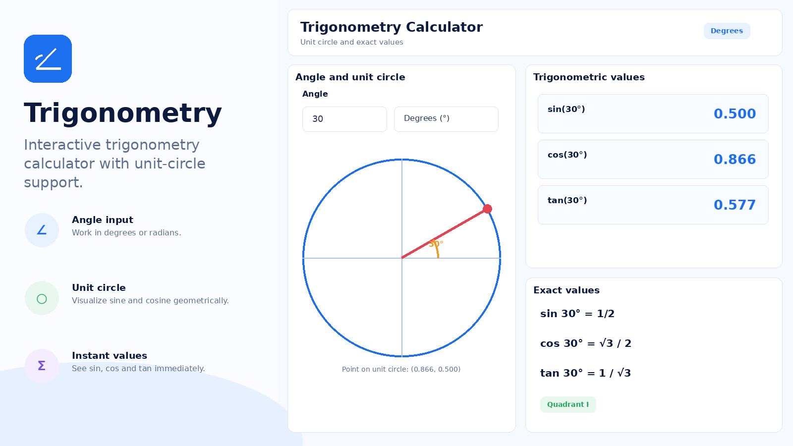

# Trigonometry

Trigonometry is a Moodle activity module that gives students an interactive calculator for exploring angles, trigonometric functions and the unit circle directly inside a course.

Teachers add it like any other activity, define the activity name and an optional description, and can use Moodle's standard activity and completion settings. Students open the activity and work with the calculator in the browser; there is no submission workflow, no grading and no storage of student answers.

## Features

- sine, cosine and tangent from an angle;
- degree and radian input;
- arc sine, arc cosine and arc tangent;
- inverse-function results in degrees and radians;
- domain handling for inverse sine and cosine;
- interactive unit circle with x/y projections and tangent visualization;
- draggable point and angle slider;
- common trigonometric identities and relationships;
- activity-view completion tracking and Moodle log events;
- course backup and restore support.

All calculations run locally in the browser and the activity does not store personal data or student answers.

## Requirements

- Moodle 4.5 or later;
- JavaScript enabled in the browser.

## Screenshots

